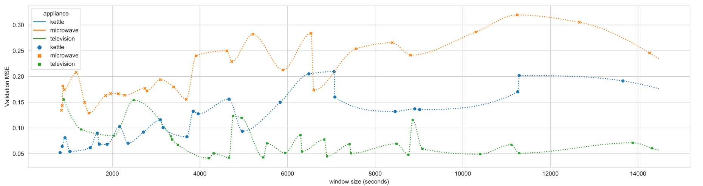
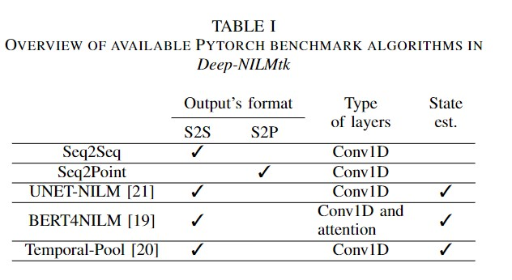

# Deep-NILM-benchmark

The current repoistory contains a set of benchmarks build on top of **Deep-NILMtk** established using the [uk-dale](provide link here please) **experiment-template** offered in the toolkit. The repository captures the whole training process and the execution environment with **MLFlow**. The goal is to provide a universal benchmark repository available for scholars in the **NILM scholarship** to use and extend with their own experiments for more transparency and easy reproducibility.
The benchmark gathers the results from two different experiments on three different appliances as follows:

## 1. Window Size Optimization

The aim of this first experiment is to explore the effect of the window size of the training process and the overall performance of model. Only one model is used for this pahse and the related literature shows that the sequence-length is not related to the model used but rather to teh characteristics of an appliance. The results obtained for thsi phase are illustated in the following figure:



The previous plots shows the impact of the sequence length on the best training validation that can be aschieved. As the figure illustrates, the sequence length has an important impact on the training process and the performance that can be aschived. For both the kettle and the microwave, the validation MSE is higher with long window sizes. On the other hand, the television have smaller recorded smaller values of validation loss with longer sequences. These findings are further confirmed using the pearson correlation. Regarding this measure, the kettle and microwave have a strong positive correlation between the input window size and the validation MSE with a p-value in the order of 10e-8. In the case of television, a negative correlation is recorded with a 0.02 p-value. These results were obtained by analysing the downloaded csv file fom teh MLFlow interafce as demonstated in the following [notebook](link).


## 2. Benchmarking NILM Algorithms

The best window size for each appliance is used to benchmark five of deep learning models available in toolkit using [PyTorch](https://pytorch.org/) as a deep learning framework.


<p align="center">
  
</p>


## Instructions to preview the benchmark

```bash
pip install mlflow==1.0.23
mlflow ui
```


## Copyright and license
Code released under the [MIT Licence](https://github.com/BHafsa/Deep-NILM-benchmark/blob/main/LICENSE).
